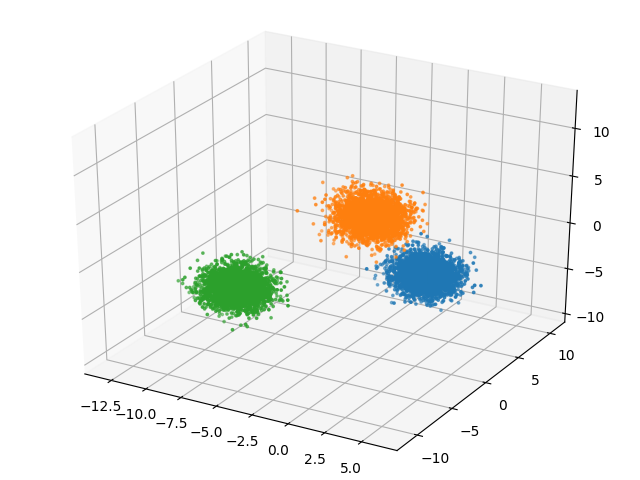
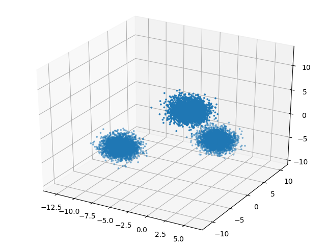

# MeanShift

C++ implementation of the 
[mean shift](https://en.wikipedia.org/wiki/Mean_shift) clustering algorithm 
with OpenMP.

In this README you will find instructions about how to compile the program and
how to execute it. In the directory `Paper` there is a technical paper about
the algorithm and the comparison of the sequential version with the parallel
version.

## Compiling

If you are used to CLion, you could open the directory `MeanShift` with the 
IDE. You will find all the necessary build configurations.

Otherwise, go to the `MeanShift` directory, create a build folder and change 
directory to that folder:


    $ cd Meanshift
    $ mkdir build
    $ cd build

Then you can compile the program in two versions:

* A sequential version:

```
$ cmake -DCMAKE_BUILD_TYPE=Release ../
$ make meanshift
```

* A parallel version, with OpenMP:

```
$ cmake -DCMAKE_BUILD_TYPE=Release DCMAKE_CXX_FLAGS=-fopenmp ../
$ make meanshift
```

The parallel version will be much faster, because it uses the OpenMP 
directives to perform multithreading operations.

## Usage

The result of the compilation is an executable called `meanshift`. It takes 
as input a CSV file containing the points to cluster and the bandwidth 
parameter of the mean shift algorithm. The points in the CSV file must be all 
of the same dimension (each row of the CSV file must contains the **same 
number of columns**) and there must be **only numerical values**. To get the 
clustering result, you must append to the command the string `--write-output 
<filename>`: the program will generate a file `<filename>.csv` containing the 
points where the last number of each row is the cluster to which the point 
belongs.

In the directory `ClusteringTests/datasets` there are some datasets to 
perform some tests.

I **strongly reccomend** you to use the python script `plot_clusters.py` 
located in the directory `ClusteringTests` to execute the program and plot 
the results. It requires Python >= 3.5, numpy and matplotlib. 
`plot_clusters.py` take as input the CSV file and the bandwidth parameter. 
Pay attention where the `meanshift` executable is located, you could set the 
right path in the script `plot_clusters.py`.

## Example

The dataset `data8.csv` contains 10000 points distributed in three gaussian 
blobs with standard deviation 1.

If we execute the mean shift algorithm with bandwidth 1 we get exactly the 
three clusters:

    $ python plot_clusters datasets/data8.csv 1
    File: datasets/data8.csv
    Number of points: 10000
    Number of dimensions: 3
    Number of clusters: 3
    Elapsed time: 6.66942 s



If we increase the bandwidth value to 10, then all the points will go in the 
same cluster:


    $ python plot_clusters.py datasets/data8.csv 10
    File: datasets/data8.csv
    Number of points: 10000
    Number of dimensions: 3
    Number of clusters: 1
    Elapsed time: 22.963 s




## Speedup

The file `speeduptest` in the directory`ClusteringTests` is a BASH script 
that executes the sequential version and then executes different parallel 
versions with a different number of threads to estimate the speedup obtained 
by parallelizing the algorithm.

The results and the analysis of the speedup is described in the technical 
paper in the directory `Paper`.
